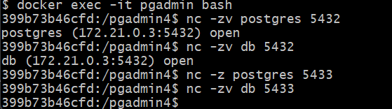
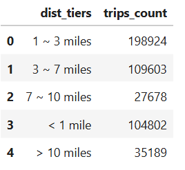
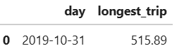
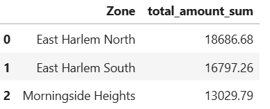
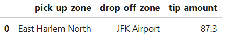

# Module 1 Homework: Docker & SQL

## Question 1. Understanding docker first run

Run docker with the python:3.12.8 image in an interactive mode, use the entrypoint bash.

What's the version of pip in the image?

- 24.3.1
- 24.2.1
- 23.3.1
- 23.2.1

## Answer to Question 1

```
docker run -it python:3.12.8 bash
root@511ad7ffddd7:/# pip --version
```

```
# output
pip 24.3.1 from /usr/local/lib/python3.12/site-packages/pip (python 3.12)
```

## Question 2. Understanding Docker networking and docker-compose

Given the following `docker-compose.yaml`, what is the `hostname` and `port` that **pgadmin** should use to connect to the postgres database?

```yaml
services:
  db:
    container_name: postgres
    image: postgres:17-alpine
    environment:
      POSTGRES_USER: 'postgres'
      POSTGRES_PASSWORD: 'postgres'
      POSTGRES_DB: 'ny_taxi'
    ports:
      - '5433:5432'
    volumes:
      - vol-pgdata:/var/lib/postgresql/data

  pgadmin:
    container_name: pgadmin
    image: dpage/pgadmin4:latest
    environment:
      PGADMIN_DEFAULT_EMAIL: "pgadmin@pgadmin.com"
      PGADMIN_DEFAULT_PASSWORD: "pgadmin"
    ports:
      - "8080:80"
    volumes:
      - vol-pgadmin_data:/var/lib/pgadmin  

volumes:
  vol-pgdata:
    name: vol-pgdata
  vol-pgadmin_data:
    name: vol-pgadmin_data
```

- postgres:5433
- localhost:5432
- db:5433
- postgres:5432
- db:5432

If there are more than one answers, select only one of them

## Answer to Question 2

**hostname**: postgres / db (i.e. both service name and container name)
**port**: 5432




##  Prepare Postgres

Run Postgres and load data as shown in the videos
We'll use the green taxi trips from October 2019:

```bash
wget https://github.com/DataTalksClub/nyc-tlc-data/releases/download/green/green_tripdata_2019-10.csv.gz
```

You will also need the dataset with zones:

```bash
wget https://github.com/DataTalksClub/nyc-tlc-data/releases/download/misc/taxi_zone_lookup.csv
```

Download this data and put it into Postgres.

You can use the code from the course. It's up to you whether
you want to use Jupyter or a python script.


## Question 3. Trip Segmentation Count

During the period of October 1st 2019 (inclusive) and November 1st 2019 (exclusive), how many trips, **respectively**, happened:
1. Up to 1 mile
2. In between 1 (exclusive) and 3 miles (inclusive),
3. In between 3 (exclusive) and 7 miles (inclusive),
4. In between 7 (exclusive) and 10 miles (inclusive),
5. Over 10 miles 


## Answers to Question 3

```sql
    SELECT
        CASE 
        WHEN trip_distance <= 1 THEN '< 1 mile'
        WHEN trip_distance > 1 AND trip_distance <= 3 THEN '1 ~ 3 miles'
        WHEN trip_distance > 3 AND trip_distance <= 7 THEN '3 ~ 7 miles'
        WHEN trip_distance > 7 AND trip_distance <= 10 THEN '7 ~ 10 miles'
        WHEN trip_distance >= 10 THEN '> 10 miles'
        END AS dist_tiers,
        COUNT(*) AS trips_count
    FROM green_tripdata
    WHERE lpep_pickup_datetime >= '2019-10-01' AND lpep_pickup_datetime < '2019-11-01' AND 
          lpep_dropoff_datetime >= '2019-10-01' AND lpep_dropoff_datetime < '2019-11-01'
    GROUP BY dist_tiers
```




## Question 4. Longest trip for each day

Which was the pick up day with the longest trip distance?
Use the pick up time for your calculations.

Tip: For every day, we only care about one single trip with the longest distance. 

- 2019-10-11
- 2019-10-24
- 2019-10-26
- 2019-10-31


## Answers to Question 4

```sql
    SELECT
        DATE(lpep_pickup_datetime) AS day,
        MAX(trip_distance) AS longest_trip
    FROM green_tripdata
    WHERE DATE(lpep_pickup_datetime) in ('2019-10-11', '2019-10-24', '2019-10-26', '2019-10-31')   
    GROUP BY DATE(lpep_pickup_datetime)
    ORDER BY longest_trip DESC
    LIMIT 1
```



## Question 5. Three biggest pickup zones

Which were the top pickup locations with over 13,000 in
`total_amount` (across all trips) for 2019-10-18?

Consider only `lpep_pickup_datetime` when filtering by date.
 
- East Harlem North, East Harlem South, Morningside Heights
- East Harlem North, Morningside Heights
- Morningside Heights, Astoria Park, East Harlem South
- Bedford, East Harlem North, Astoria Park


## Answer to Question 5

```sql
    SELECT
        t2."Zone", 
        sum(T1.total_amount) as total_amount_sum
    FROM green_tripdata t1
    LEFT JOIN zone t2 ON t1."PULocationID" = t2."LocationID"
    WHERE DATE(t1.lpep_pickup_datetime) = '2019-10-18'
    GROUP BY t2."Zone"
    HAVING SUM(t1.total_amount) > 13000
    ORDER BY total_amount_sum DESC
    LIMIT 3
```




## Question 6. Largest tip

For the passengers picked up in October 2019 in the zone
named "East Harlem North" which was the drop off zone that had
the largest tip?

Note: it's `tip` , not `trip`

We need the name of the zone, not the ID.

- Yorkville West
- JFK Airport
- East Harlem North
- East Harlem South

## Answer to Question 6

```sql
    SELECT
        t3."Zone" As pick_up_zone,
        t2."Zone" As drop_off_zone, 
        MAX(T1.tip_amount) as tip_amount
    FROM green_tripdata t1
    LEFT JOIN zone t2 ON t1."DOLocationID" = t2."LocationID"
    INNER JOIN zone t3 ON t1."PULocationID" = t3."LocationID"
    WHERE DATE(t1.lpep_pickup_datetime) >= '2019-10-01' AND DATE(t1.lpep_pickup_datetime) <= '2019-10-30'
        AND t3."Zone" = 'East Harlem North'
    GROUP BY t3."Zone", t2."Zone"
    ORDER BY tip_amount DESC
    LIMIT 1;
```




## Terraform

In this section homework we'll prepare the environment by creating resources in GCP with Terraform.

In your VM on GCP/Laptop/GitHub Codespace install Terraform. 
Copy the files from the course repo
[here](../../../01-docker-terraform/1_terraform_gcp/terraform) to your VM/Laptop/GitHub Codespace.

Modify the files as necessary to create a GCP Bucket and Big Query Dataset.


## Question 7. Terraform Workflow

Which of the following sequences, **respectively**, describes the workflow for: 
1. Downloading the provider plugins and setting up backend,
2. Generating proposed changes and auto-executing the plan
3. Remove all resources managed by terraform`

Answers:
- terraform import, terraform apply -y, terraform destroy
- teraform init, terraform plan -auto-apply, terraform rm
- terraform init, terraform run -auto-approve, terraform destroy
- terraform init, terraform apply -auto-approve, terraform destroy
- terraform import, terraform apply -y, terraform rm


## Answer to Question 7

1. Downloading the provider plugins and setting up backend

```bash
terraform init
```

2. Generating proposed changes and auto-executing the plan

```bash
terraform plan -auto-apply
```


3. Remove all resources managed by terraform`

```bash
terraform destroy
```


## Submitting the solutions

* Form for submitting: https://courses.datatalks.club/de-zoomcamp-2025/homework/hw1


