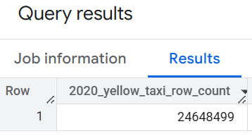

## Module 2 Homework

ATTENTION: At the end of the submission form, you will be required to include a link to your GitHub repository or other public code-hosting site. This repository should contain your code for solving the homework. If your solution includes code that is not in file format, please include these directly in the README file of your repository.

> In case you don't get one option exactly, select the closest one 

For the homework, we'll be working with the _green_ taxi dataset located here:

`https://github.com/DataTalksClub/nyc-tlc-data/releases/tag/green/download`

To get a `wget`-able link, use this prefix (note that the link itself gives 404):

`https://github.com/DataTalksClub/nyc-tlc-data/releases/download/green/`

### Assignment

So far in the course, we processed data for the year 2019 and 2020. Your task is to extend the existing flows to include data for the year 2021.


As a hint, Kestra makes that process really easy:
1. You can leverage the backfill functionality in the [scheduled flow](../../../02-workflow-orchestration/flows/06_gcp_taxi_scheduled.yaml) to backfill the data for the year 2021. Just make sure to select the time period for which data exists i.e. from `2021-01-01` to `2021-07-31`. Also, make sure to do the same for both `yellow` and `green` taxi data (select the right service in the `taxi` input).
2. Alternatively, run the flow manually for each of the seven months of 2021 for both `yellow` and `green` taxi data. Challenge for you: find out how to loop over the combination of Year-Month and `taxi`-type using `ForEach` task which triggers the flow for each combination using a `Subflow` task.

### Quiz Questions

Complete the Quiz shown below. It’s a set of 6 multiple-choice questions to test your understanding of workflow orchestration, Kestra and ETL pipelines for data lakes and warehouses.

1) Within the execution for `Yellow` Taxi data for the year `2020` and month `12`: what is the uncompressed file size (i.e. the output file `yellow_tripdata_2020-12.csv` of the `extract` task)?


Answer: 134.5 MB


2) What is the rendered value of the variable `file` when the inputs `taxi` is set to `green`, `year` is set to `2020`, and `month` is set to `04` during execution?

Answer: `green_tripdata_2020-04.csv`

This can be found from the kestra execution log.


3) How many rows are there for the `Yellow` Taxi data for all CSV files in the year 2020?

Answer: 24,648,499

```sql
SELECT COUNT(*) AS `2020_yellow_taxi_row_count`
FROM `kestra-sandbox-460718.zoomcamp.yellow_tripdata` 
WHERE filename LIKE '%2020%'
```




4) How many rows are there for the `Green` Taxi data for all CSV files in the year 2020?

Answer: 1,734,051

```sql
SELECT COUNT(*) AS `2020_green_taxi_rows`
FROM `kestra-sandbox-460718.zoomcamp.green_tripdata` 
WHERE filename like '%2020%'
```


5) How many rows are there for the `Yellow` Taxi data for the March 2021 CSV file?

Answer: 1,925,152

```sql
SELECT COUNT(*) AS `March_2021_yellow_taxi_row_count`
FROM `kestra-sandbox-460718.zoomcamp.yellow_tripdata` 
WHERE filename LIKE '%2021-03%'
```


6) How would you configure the timezone to New York in a Schedule trigger?

Answer: Add a `timezone` property set to `America/New_York` in the `Schedule` trigger configuration

This is based on [kestra doc](https://kestra.io/plugins/core/trigger/io.kestra.plugin.core.trigger.schedule#properties_timezone-body) and [time zone identifier](https://en.wikipedia.org/wiki/List_of_tz_database_time_zones).