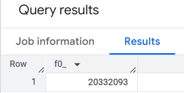

## Module 3 Homework

ATTENTION: At the end of the submission form, you will be required to include a link to your GitHub repository or other public code-hosting site. 
This repository should contain your code for solving the homework. If your solution includes code that is not in file format (such as SQL queries or 
shell commands), please include these directly in the README file of your repository.

<b><u>Important Note:</b></u> <p> For this homework we will be using the Yellow Taxi Trip Records for **January 2024 - June 2024 NOT the entire year of data** 
Parquet Files from the New York
City Taxi Data found here: </br> https://www.nyc.gov/site/tlc/about/tlc-trip-record-data.page </br>
If you are using orchestration such as Kestra, Mage, Airflow or Prefect etc. do not load the data into Big Query using the orchestrator.</br> 
Stop with loading the files into a bucket. </br></br>

**Load Script:** You can manually download the parquet files and upload them to your GCS Bucket or you can use the linked script [here](./load_yellow_taxi_data.py):<br>
You will simply need to generate a Service Account with GCS Admin Priveleges or be authenticated with the Google SDK and update the bucket name in the script to the name of your bucket<br>
Nothing is fool proof so make sure that all 6 files show in your GCS Bucket before begining.</br><br>

<u>NOTE:</u> You will need to use the PARQUET option files when creating an External Table</br>

<b>BIG QUERY SETUP:</b></br>
Create an external table using the Yellow Taxi Trip Records. </br>
Create a (regular/materialized) table in BQ using the Yellow Taxi Trip Records (do not partition or cluster this table). </br>
</p>


```sql
/*External Table*/
CREATE OR REPLACE EXTERNAL TABLE `zoomcamp.yellow_tripdata_2024_ext`
OPTIONS (
  format = 'PARQUET',
  uris = ['gs://de-zoomcamp-hw-461320/yellow_tripdata_2024-*.parquet']
);
```

```sql
/*Materalized Table*/
CREATE OR REPLACE TABLE `zoomcamp.yellow_tripdata_2024` AS
SELECT * FROM `zoomcamp.yellow_tripdata_2024_ext`;
```


## Question 1:
Question 1: What is count of records for the 2024 Yellow Taxi Data?
- 65,623
- 840,402
- 20,332,093
- 85,431,289


Answer: 20,332,093

```sql
SELECT COUNT(*) 
FROM `de-zoomcamp-hw-461320.zoomcamp.yellow_tripdata_2024_ext`
```




## Question 2:
Write a query to count the distinct number of PULocationIDs for the entire dataset on both the tables.</br> 
What is the **estimated amount** of data that will be read when this query is executed on the External Table and the Table?

- 18.82 MB for the External Table and 47.60 MB for the Materialized Table
- 0 MB for the External Table and 155.12 MB for the Materialized Table
- 2.14 GB for the External Table and 0MB for the Materialized Table
- 0 MB for the External Table and 0MB for the Materialized Table

Answer: 0 MB for the External Table and 155.12 MB for the Materialized Table

```sql
/*0 MB to run*/
SELECT COUNT(DISTINCT PULocationID) 
FROM `de-zoomcamp-hw-461320.zoomcamp.yellow_tripdata_2024_ext`;
```


```sql
/*155.12 MB to run*/
SELECT COUNT(DISTINCT PULocationID) 
FROM `de-zoomcamp-hw-461320.zoomcamp.yellow_tripdata_2024`;
```


## Question 3:
Write a query to retrieve the PULocationID from the table (not the external table) in BigQuery. Now write a query to retrieve the PULocationID and DOLocationID on the same table. Why are the estimated number of Bytes different?
- BigQuery is a columnar database, and it only scans the specific columns requested in the query. Querying two columns (PULocationID, DOLocationID) requires reading more data than querying one column (PULocationID), leading to a higher estimated number of bytes processed.
- BigQuery duplicates data across multiple storage partitions, so selecting two columns instead of one requires scanning the table twice, 
doubling the estimated bytes processed.
- BigQuery automatically caches the first queried column, so adding a second column increases processing time but does not affect the estimated bytes scanned.
- When selecting multiple columns, BigQuery performs an implicit join operation between them, increasing the estimated bytes processed

Answer: BigQuery is a columnar database, and it only scans the specific columns requested in the query. Querying two columns (PULocationID, DOLocationID) requires reading more data than querying one column (PULocationID), leading to a higher estimated number of bytes processed.


## Question 4:
How many records have a fare_amount of 0?
- 128,210
- 546,578
- 20,188,016
- 8,333


Answer: 8,333

```sql
SELECT COUNT(*)
FROM `de-zoomcamp-hw-461320.zoomcamp.yellow_tripdata_2024`
WHERE fare_amount = 0;
```


## Question 5:
What is the best strategy to make an optimized table in Big Query if your query will always filter based on tpep_dropoff_datetime and order the results by VendorID (Create a new table with this strategy)
- Partition by tpep_dropoff_datetime and Cluster on VendorID
- Cluster on by tpep_dropoff_datetime and Cluster on VendorID
- Cluster on tpep_dropoff_datetime Partition by VendorID
- Partition by tpep_dropoff_datetime and Partition by VendorID


Answer: Partition by tpep_dropoff_datetime and Cluster on VendorID

Partitioning helps reduce the amount of data scanned by splitting the table into segments. Since we want to filter based on `tpep_dropoff_datetime`, this is ideal for partitioning.

Clustering helps sort data within each partition for faster access. Since we order by `VendorID`, clustering on `VendorID` improves performance for sorting and filtering on that column.


```sql
CREATE OR REPLACE TABLE `de-zoomcamp-hw-461320.zoomcamp.yellow_tripdata_2024_optmized`
PARTITION BY DATE(tpep_dropoff_datetime)
CLUSTER BY VendorID
AS
SELECT * FROM `de-zoomcamp-hw-461320.zoomcamp.yellow_tripdata_2024`;
```


## Question 6:
Write a query to retrieve the distinct VendorIDs between tpep_dropoff_datetime
2024-03-01 and 2024-03-15 (inclusive)</br>

Use the materialized table you created earlier in your from clause and note the estimated bytes. Now change the table in the from clause to the partitioned table you created for question 5 and note the estimated bytes processed. What are these values? </br>

Choose the answer which most closely matches.</br> 

- 12.47 MB for non-partitioned table and 326.42 MB for the partitioned table
- 310.24 MB for non-partitioned table and 26.84 MB for the partitioned table
- 5.87 MB for non-partitioned table and 0 MB for the partitioned table
- 310.31 MB for non-partitioned table and 285.64 MB for the partitioned table

Answer: 310.24 MB for non-partitioned table and 26.84 MB for the partitioned table.

```sql
SELECT DISTINCT VendorID
FROM `de-zoomcamp-hw-461320.zoomcamp.yellow_tripdata_2024`
WHERE tpep_dropoff_datetime BETWEEN '2024-03-01' and '2024-03-15';
```


```sql
SELECT DISTINCT VendorID
FROM `de-zoomcamp-hw-461320.zoomcamp.yellow_tripdata_2024_optmized`
WHERE tpep_dropoff_datetime BETWEEN '2024-03-01' and '2024-03-15';
```


## Question 7: 
Where is the data stored in the External Table you created?

- Big Query
- Container Registry
- GCP Bucket
- Big Table

Answer: GCP Bucket


## Question 8:
It is best practice in Big Query to always cluster your data:
- True
- False

Answer: False

Clustering improves performance only if:

- frequently filter or group by the clustering columns
- The table is large enough for clustering to make a difference

Otherwise:

- Clustering costs more to maintain
- Might not improve query performance for small or infrequently queried tables


## (Bonus: Not worth points) Question 9:
No Points: Write a `SELECT count(*)` query FROM the materialized table you created. How many bytes does it estimate will be read? Why?


Answer: 0 bytes. Because BigQuery can read this info from the metadata.


